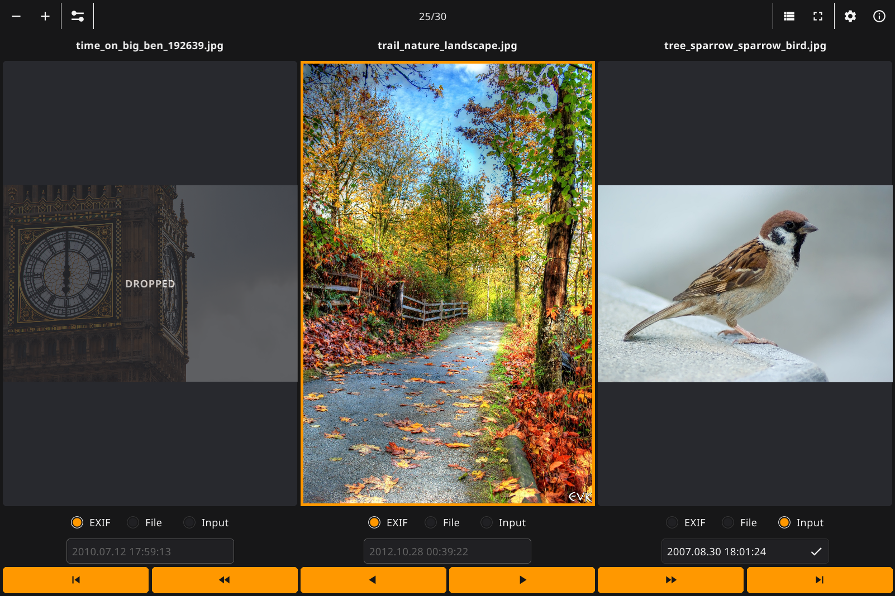
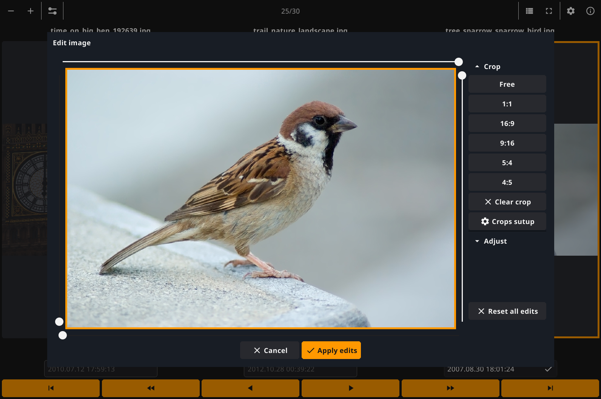
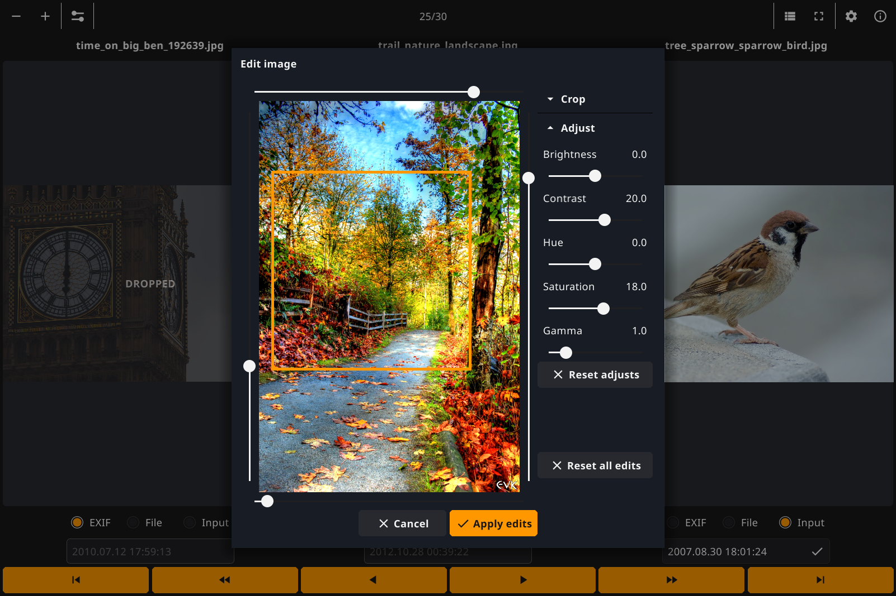

---
### Use Pixyne to quickly review your photo folders, safely delete bad and similar shots, fix the shooting dates, crop and ajust photos    

---







## How to use

Pixyne application has a simple and intuitive interface:   
* With a click on photo you can mark to drop it in the trash.
* In Advanced mode you may also set or correct the EXIF shooting date crop the size and ajust selected photo.
* When you save changes, you can change all file names to EXIF shooting date format.  
* In a list view, clicking on a row number button opens the corresponding photo.  
* Changes will not be applied until you save. Pixyne automaticaly stores the current state of the folder so you can undo changes at any time. This is useful when working with a large number of photos and you need to close the application in order to continue working later.   
* If you open another folder, all unsaved changes will be lost but not photos
* On save originals of modified and dropped photos will be copied to "backup" subfolder.
* You can control the application using the keyboard. To see the hotkeys, press `Alt+K`  

Enjoy!  

## Ready to use

For Linux users, Burnfix is avaliable as a Flatpak on [Flathub](https://flathub.org/apps/io.github.vinser.burnfix):

<a href='https://flathub.org/apps/details/io.github.vinser.pixyne'></a>

Another easy way to install the application is to download and run the installation file from the [latest release](https://github.com/vinser/pixyne/releases/tag/v1.6.0) that matches your operating system and CPU type. Pre-built binaries are available for  

|OS        |CPU type              |Install package            |Tested<sup>1</sup> |  
|----------|----------------------|---------------------------|:------:|  
|Linux     | Intel, AMD 64-bit    | pixyne-linux-amd64.tar.xz |No      |  
|Linux     | ARM 64-bit           | pixyne-linux-arm64.tar.xz |Yes     |
|Linux     | ARM 32-bit           | pixyne-linux-arm.tar.xz   |No      |
|OS X (MAC)| Intel 64-bit         | pixyne-macosx-amd64.dmg   |No      |  
|OS X (MAC)| ARM 64-bit           | pixyne-macosx-arm64.dmg   |No      |  
|Windows   | Intel, AMD 64-bit    | pixyne-windows-amd64.msi  |Yes     |  

<sup>1</sup>_Some of packages was only cross-builded and not tested on real desktops, but you can still try them out_  

## Building

Pixyne compiles into a statically linked binary with no explicit runtime dependencies. 

Compiling requires a [Go](https://go.dev) compiler (v1.18 or later is required) and the [prerequisites for Fyne](https://developer.fyne.io/started/).

On systems with the above compile-time requirements met you can build the project using `go build` in the project root:
```
git clone https://github.com/vinser/pixyne.git
go build .
```
---
*Created using [Fyne](https://github.com/fyne-io/fyne) GUI library*  
*App icon design from [Icon8](https://icon8.com)*  

